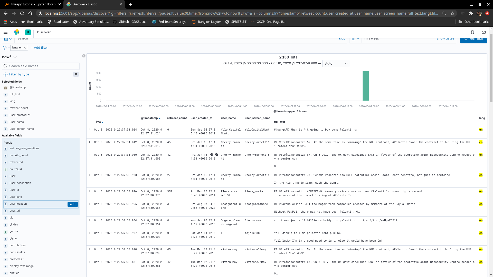
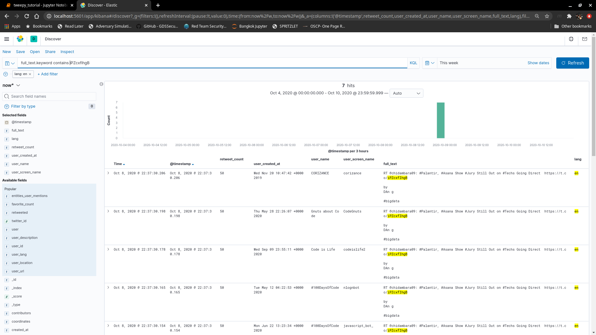

# Open Source Intelligence with Elasticsearch: Analyzing Twitter Feeds [Part 2 of 3]
> Andrew Eng | 2020-10-08

## Introduction

## Get up to date
I expanded the search criteria to include all of the metadata from each tweet.  That way, I can go back to it and form new questions around the data I'm exploring.  I need to clean it up a bit more.  There are still several lists and dictionaries that I can't simply search for or get stats.

Since the code was getting larger than I expected.  I took out some uneeded things.  I simplified the feed to elastic function

```python
while count < len(feed):
        doc = {
            '@timestamp': dt.now(),
            'created_at': str(feed[count]['created_at']),
            'twitter_id' : int(feed[count]['id']),
            'id_str' : int(feed[count]['id_str']),
            'full_text' : str(feed[count]['full_text']),
            'truncated' : str(feed[count]['truncated']),
            'display_text_range' : str(feed[count]['display_text_range']),
            'entities' : str(feed[count]['entities']), # Already split the dictionary, no longer needed 
            'metadata' : str(feed[count]['metadata']),
            'source' : str(feed[count]['source']),
            'in_reply_to_status_id' : str(feed[count]['in_reply_to_status_id']),
            'in_reply_to_status_id_str' : str(feed[count]['in_reply_to_status_id_str']),
            'in_reply_to_user_id' : str(feed[count]['in_reply_to_user_id']),
            'in_reply_to_user_id_str' : str(feed[count]['in_reply_to_user_id_str']),
            'in_reply_to_screen_name' : str(feed[count]['in_reply_to_screen_name']),
            'user' : str(feed[count]['user']), # Already split the dictionary, no longer needed
            'geo' : str(feed[count]['geo']),
            'coordinates' : str(feed[count]['coordinates']),
            'place' : str(feed[count]['place']),
            'contributors' : str(feed[count]['contributors']),
            #'retweeted_status' : str(feed[count]['retweeted_status']),
            'is_quote_status' : str(feed[count]['is_quote_status']),
            'retweet_count' : str(feed[count]['retweet_count']),
            'favorite_count' : str(feed[count]['favorite_count']),
            'favorited' : str(feed[count]['favorited']),
            'retweeted' : str(feed[count]['retweeted']),
            'lang' : str(feed[count]['lang']),
            'user_id' : str(feed[count]['user']['id']),
            'user_id_str' : str(feed[count]['user']['id_str']),
            'user_name' : str(feed[count]['user']['name']),
            'user_screen_name' : str(feed[count]['user']['screen_name']),
            'user_location' : str(feed[count]['user']['location']),
            'user_description' : str(feed[count]['user']['description']),
            'user_url' : str(feed[count]['user']['url']),
            'user_protected' : str(feed[count]['user']['protected']),
            'user_followers_count' : str(feed[count]['user']['followers_count']),
            'user_friends_count' : str(feed[count]['user']['friends_count']),
            'user_listed_count' : str(feed[count]['user']['listed_count']),
            'user_created_at' : str(feed[count]['user']['created_at']),
            'user_favourites_count' : str(feed[count]['user']['favourites_count']),
            'user_utc_offset' : str(feed[count]['user']['utc_offset']),
            'user_time_zone' : str(feed[count]['user']['time_zone']),
            'user_geo_enabled' : str(feed[count]['user']['geo_enabled']),
            'user_verified' : str(feed[count]['user']['verified']),
            'user_statuses_count' : str(feed[count]['user']['statuses_count']),
            'user_lang' : str(feed[count]['user']['lang']),
            'user_contributors_enabled' : str(feed[count]['user']['contributors_enabled']),
            'user_is_translator' : str(feed[count]['user']['is_translator']),
            'user_is_translation_enabled' : str(feed[count]['user']['is_translation_enabled']),
            'user_profile_background_color' : str(feed[count]['user']['profile_background_color']),
            'user_profile_background_image_url' : str(feed[count]['user']['profile_background_image_url']),
            'user_profile_background_image_url_https' : str(feed[count]['user']['profile_background_image_url_https']),
            'user_profile_background_tile' : str(feed[count]['user']['profile_background_tile']),
            'user_profile_image_url' : str(feed[count]['user']['profile_image_url']),
            'user_profile_image_url_https' : str(feed[count]['user']['profile_image_url_https']),
            #'user_profile_banner_url' : str(feed[count]['user']['profile_banner_url']),
            'user_profile_link_color' : str(feed[count]['user']['profile_link_color']),
            'user_profile_sidebar_border_color' : str(feed[count]['user']['profile_sidebar_border_color']),
            'user_profile_sidebar_fill_color' : str(feed[count]['user']['profile_sidebar_fill_color']),
            'user_profile_text_color' : str(feed[count]['user']['profile_text_color']),
            'user_profile_use_background_image' : str(feed[count]['user']['profile_use_background_image']),
            'user_has_extended_profile' : str(feed[count]['user']['has_extended_profile']),
            'user_default_profile' : str(feed[count]['user']['default_profile']),
            'user_default_profile_image' : str(feed[count]['user']['default_profile_image']),
            'user_following' : str(feed[count]['user']['following']),
            'user_follow_request_sent' : str(feed[count]['user']['follow_request_sent']),
            'user_notifications' : str(feed[count]['user']['notifications']),
            'user_translator_type' : str(feed[count]['user']['translator_type']),
            'entities_hashtags' : str(feed[count]['entities']['hashtags']),
            'entities_symbols' : str(feed[count]['entities']['symbols']),
            'entities_user_mentions' : str(feed[count]['entities']['user_mentions']),
            'entities_urls' : str(feed[count]['entities']['urls']),
            #'entities_media' : str(feed[count]['entities']['media']),
            #'extended_entities_media' : str(feed[count]['extended_entities']['media']),
            'metadata_iso_language_code' : str(feed[count]['metadata']['iso_language_code']),
            'metadata_result_type' : str(feed[count]['metadata']['result_type']),
            #'retweeted_status_created_at' : str(feed[count]['retweeted_status']['created_at']),
            #'retweeted_status_id' : str(feed[count]['retweeted_status']['id']),
            #'retweeted_status_id_str' : str(feed[count]['retweeted_status']['id_str']),
            #'retweeted_status_full_text' : str(feed[count]['retweeted_status']['full_text']),
            #'retweeted_status_truncated' : str(feed[count]['retweeted_status']['truncated']),
            #'retweeted_status_display_text_range' : str(feed[count]['retweeted_status']['display_text_range']),
            #'retweeted_status_source' : str(feed[count]['retweeted_status']['source']),
            #'retweeted_status_in_reply_to_status_id' : str(feed[count]['retweeted_status']['in_reply_to_status_id']),
            #'retweeted_status_in_reply_to_status_id_str' : str(feed[count]['retweeted_status']['in_reply_to_status_id_str']),
            #'retweeted_status_in_reply_to_user_id' : str(feed[count]['retweeted_status']['in_reply_to_user_id']),
            #'retweeted_status_in_reply_to_user_id_str' : str(feed[count]['retweeted_status']['in_reply_to_user_id_str']),
            #'retweeted_status_in_reply_to_screen_name' : str(feed[count]['retweeted_status']['in_reply_to_screen_name']),
            #'retweeted_status_geo' : str(feed[count]['retweeted_status']['geo']),
            #'retweeted_status_coordinates' : str(feed[count]['retweeted_status']['coordinates']),
            #'retweeted_status_place' : str(feed[count]['retweeted_status']['place']),
            #'retweeted_status_contributors' : str(feed[count]['retweeted_status']['contributors']),
            #'retweeted_status_is_quote_status' : str(feed[count]['retweeted_status']['is_quote_status']),
            #'retweeted_status_retweet_count' : str(feed[count]['retweeted_status']['retweet_count']),
            #'retweeted_status_favorite_count' : str(feed[count]['retweeted_status']['favorite_count']),
            #'retweeted_status_favorited' : str(feed[count]['retweeted_status']['favorited']),
            #'retweeted_status_retweeted' : str(feed[count]['retweeted_status']['retweeted']),
            #'retweeted_status_possibly_sensitive' : str(feed[count]['retweeted_status']['possibly_sensitive']),
            #'retweeted_status_lang' : str(feed[count]['retweeted_status']['lang']),
            #'retweeted_status_entities_hashtags' : str(feed[count]['retweeted_status']['entities']['hashtags']),
            #'retweeted_status_entities_symbols' : str(feed[count]['retweeted_status']['entities']['symbols']),
            #'retweeted_status_entities_user_mentions' : str(feed[count]['retweeted_status']['entities']['user_mentions']),
            #'retweeted_status_entities_urls' : str(feed[count]['retweeted_status']['entities']['urls']),
            #'retweeted_status_entities_media' : str(feed[count]['retweeted_status']['entities']['media']),
            #'user_entities_description_urls': str(feed['user']['entities']['description']['urls'])
            'word_list':  str(feed[count]['full_text']).split(' ')
        }
```

This clean up was pretty interesting.  I had to think of ways I can keep iterating through dictionaries to extract the items for each key.  I want a simple dictionary that I can stat on.  I'm sure I can clean it up a bit more, but here's the iterator I created:

```python
# What keys are used
parentList = []
subList = []

# Add dictionaries to sub process list
def subProcess(dictionary):
    subList.append(dictionary)
    
for item in feed.keys():
    parentList.append(item)

for i in parentList:
    if type(feed[i]) is not dict:
        print(f"{i} = feed['{i}']")
        
    else:
        subProcess(i)

############ From there, I iterated through more dictionaries ############
# Add dictionaries to sub process list
def subProcess(dictionary):
    subList.append(dictionary)

def iterateThrough(sub):
    narrowDown = []
    for i2 in feed[sub].keys():
        narrowDown.append(i2)
        if type(feed['retweeted_status'][sub][i2]) is not dict:
            print(f"retweeted_status_{sub}_{i2} = feed['retweeted_status'['{sub}']['{i2}']")
        else:
            print(i2)      
        
iterateThrough('entities')
```

It's actually pretty nasty and bad coding, but I wanted to put it in here as a reminder for myself to clean it up.  Maybe this it's better to publish my horrible mistakes and talk about ways I can optimize it.  I'll probably go the latter.

## Exploratory Data Analysis


My initial EDA of the data, I am focusing on the following records:
1. timestamp
2. full_text
3. lang
4. retweet_count
5. user_created_at
6. user_screen_name

I'm sure after I clean up the data a little more, there will be more records I'll be adding onto my tracking list.



I was super excited that I was able to quickly identify bots during my EDA.  I'll have to think more of techniques.  Notice how the number of retweets are the same.  This guy has bots setup to tweet and retweet at specific intervals (lol).  

Other search criteria I was looking at was keywords (contracts, buy, sell).  I may have to create a whole series on sentiment analysis and trending.
