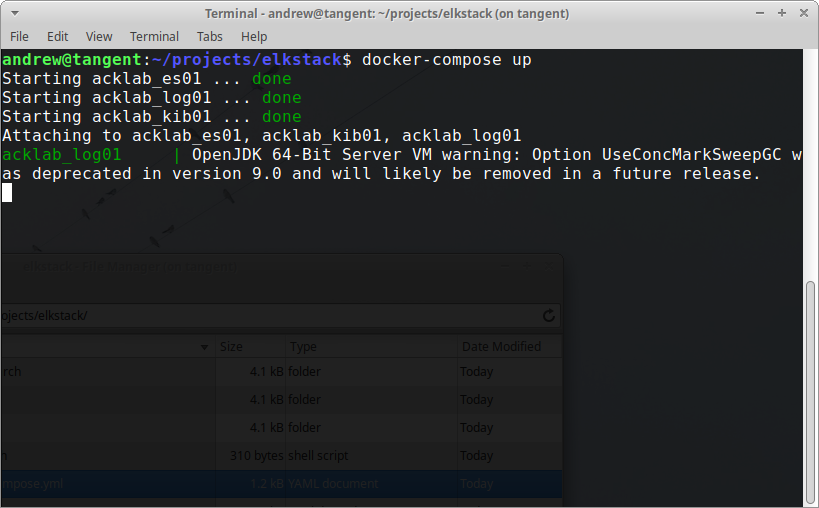
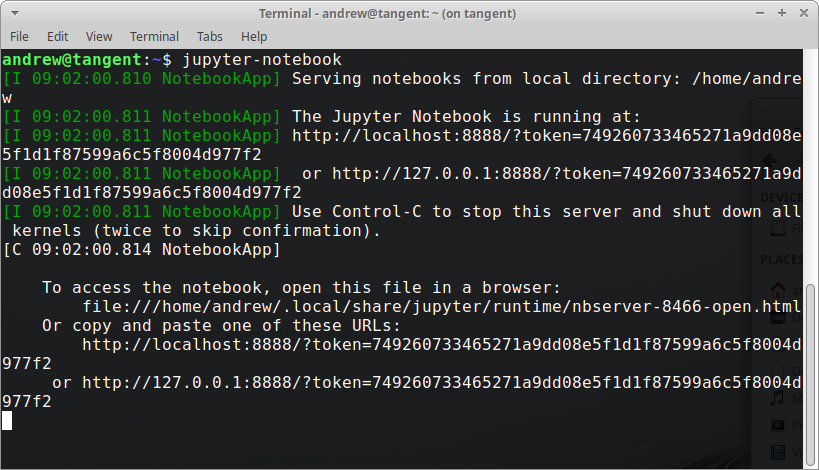
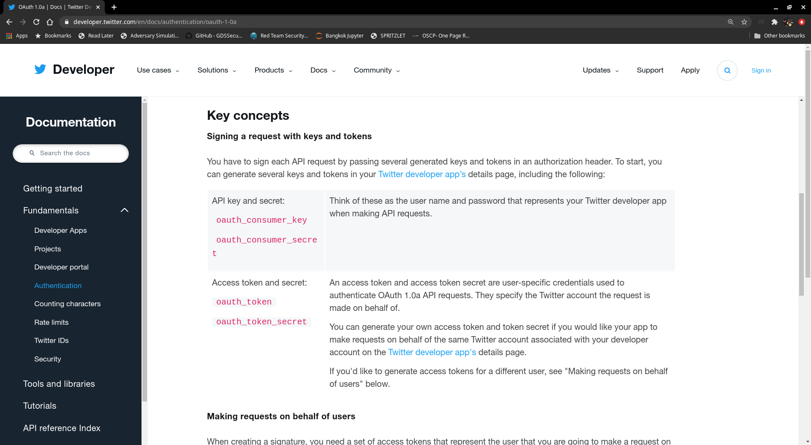

# Visualizing Tweets with Elasticsearch and Kibana
> Author: Andrew Eng | Updated: 2020-10-05

## Start with Why
I had an opportunity to interview with a large tech company but I didn't know much about them (I've been oblivious of what's popping up in Silicon Valley).  In order to do my due diligence and prepare for the interview, I spent the weekend working on this to help me better understand the general sentiments and what the company was about.  At that point in time, any news is new news, and I wanted to consume it.

Twitter is a great social networking platform that delivers almost real-time news generated and posted by "regular people".  It's great, because it's really unfiltered and you're able to somewhat grasp what people is thinking when "reporting".  The goal of this project is to build a twitter scrapper, dump it into Elasticsearch and create visualization dashboards using Kibana.  

**Why do this?**

Like most people, I'm a visual person.  I love looking at dashboards, graphs, and pictures that depict data.  It helps me comprehend and gain insight on a particular subject.  I'm also a project based learner.  I learn better when I have an end goal.  In this case, I'm learning: Python, Elasticsearch, and Kibana.  I'm also learning how to use the Twitter API for other projects that I'm working on like Natural Language Processing (Sentiment Analysis, bots, docker, etc.)

### Visualizations: What questions are we trying to answer?
My main focus was to track trending stories on a given topic and see who is popular and identify potential "influencers".  I am interested in the social impact on how influencers sway netizens.  In general, I usually read the Wall Street Journal and then throughout the day hop on Twitter to see if my views could be shifted and/or validated on a given topic.

1. What is the most retweets of a specific search term? (Tracking topic popularity)
2. How many unique users are tweeting about a given search term? (Is it trending?)
3. What other tweets are they posting about the search term? (Are they a troll / bot?)
4. How many likes does the person have on the search term? (Trending / Sentiments)?

## My Environment
It really doesn't matter what I'm using, because the processing is low overhead.  It's not processing intensive calculations or stitching anything together.  It's simple: grab tweets, format it into JSON, and send it off to Elasticsearch.  For this environment, I'll be using docker to quickly standup an ELKSTACK so I can work on the coding parts.

### Docker

<code>$ git clone https://github.com/andreweng/elkstack.git</code>

<code>$ cd elkstack</code>

<code>$ cd docker-compose up</code>



Afterwards, test you have ELKSTACK up and running by browsing to: **[http://localhost:5601](http://localhost:5601)**


### Python

For my twitter scrapper, I'll be using python 3.8.3 and my IDE will be Jupyter Notebook.  Jupyter Notebook is a great Integrated Development Environment that allows you to write code in blocks and run it individually within a web browser.  It's easy to initiate and secure enough to get the job done and tear it down.  By default, Jupyter will create open port 8888 on localhost (127.0.0.1) with unique tokens every time you initiate it. 

<code>$ cd ~/elkstack/scripts</code>

<code>$ jupyter-notebook</code>



The command above is run on a terminal window while inside the elkstack/scripts folder.

## Coding
### Twitter API
Since we are going to programmatically access twitter and pull records, we'll need to use the Twitter API.  

#### Authenticaiton
There are 3 types of authentication APIs we can use:
1. OAuth 1.0a
  - OAuth 1.0a is a method used to make API requests on behalf of a Twitter Account.

2. OAuth 2.0 Bearer Token
  - OAuth 2.0 Bearer Token is a authenticates requests onf behalf of your developer App.  Specifically, it allows your app to pull records in READ-ONLY.

3. Basic Authentication
  - Basic Authentication accesses twitter as you, it's basic authentication where you pass your email and password to the app.

For this use-case, I'll be using the OAuth 1.0a, this is mainly so I can access a full range of APIs for later scalability.



### Python Modules

**Quick install of modules:**

<code>$ sudo pip3 install -r requirements.txt</code>

Let's take a look at what modules we are using.  If you used requirements.txt to install the modules, you don't need to run the below commands.

**External modules:**

[Tweepy](https://github.com/tweepy/tweepy) **|** [Documentation](http://docs.tweepy.org/en/latest/index.html)  

[Elasticsearch](https://github.com/elastic/elasticsearch-py) **|** [Documentation](https://elasticsearch-py.readthedocs.io/en/master/)

**Built in modules:**

[json Documentation](https://docs.python.org/3/library/json.html)

[datetime Documentation](https://docs.python.org/3/library/datetime.html)

<code>$ sudo pip install tweepy</code>


### Execute
```python
import tweepy as tw
import json
import elasticsearch
import datetime as dt
```

```python
# Set elasticsearch server
es = elasticsearch.Elasticsearch([{"host":"localhost","port":9200}])

# Initialize dictionary
twitter_cred = dict()

# Enter API keys
twitter_cred["CONSUMER_KEY"] = "<API KEY>"
twitter_cred["CONSUMER_SECRET"] = "<API KEY>"

# Access Tokens
twitter_cred["ACCESS_KEY"] = "<API KEY>"
twitter_cred["ACCESS_SECRET"] = "<API KEY>"

auth = tw.OAuthHandler(twitter_cred["CONSUMER_KEY"], twitter_cred["CONSUMER_SECRET"])

auth.set_access_token(twitter_cred["ACCESS_KEY"], twitter_cred["ACCESS_SECRET"])

api = tw.API(auth, wait_on_rate_limit=True)
```

```python
search = "palantir"
date_since = "2015-01-01"
```

```python
tweets = []

datetime_object = dt.date.today()
index_name = f"{search} - {datetime_object}"

tweets = tw.Cursor(api.search, 
            q = search, 
            tweet_mode = "extended", 
            lang = "en", 
            since = date_since).items(3000)

with open("tweets.txt", "w") as tweetfile:

    tweet_data = {}

    for tweet in tweets:
        tweet_data = {"timestamp":tweet.created_at, "tweet":tweet._json}

        es.index(index=index_name, 
                    ignore = 400, 
                    doc_type = "tweet", 
                    id = tweet.id, 
                    body = tweet_data)

        tweetfile.write(str(tweet_data))

tweetfile.close()

```
## Create Visualizations with Kibana

## Conclusion

## References:
[1] [Introduction to tweepy, Twitter for Python](https://www.pythoncentral.io/introduction-to-tweepy-twitter-for-python/), August 2013: Python Central
